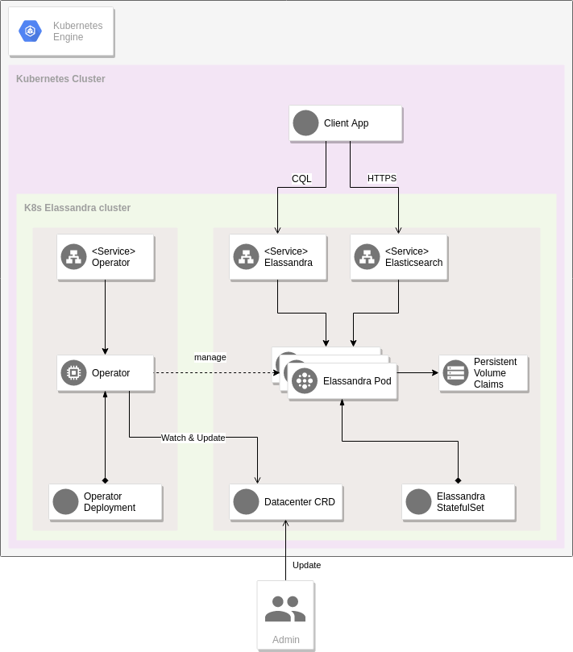

# Strapkop Google k8s Marketplace

[](https://travis-ci.org/strapdata/elassandra-google-k8s-marketplace)


This repository contains instructions and files necessary for running Strapkop the [Elassandra](https://github.com/strapdata/elassandra) operator via 
[Google's Hosted Kubernetes Marketplace](https://console.cloud.google.com/marketplace/browse?filter=solution-type:k8s).

# Overview

As shown in the figure below, Elassandra nodes are deployed as a kubernetes statefulset, and expose two kubernetes services, one for Apache Cassandra and one for Elasticsearch.
The operator container uses a "Datacenter" Custom Resource Definition to keep track of the Elassandra cluster state. (**Note**: the CRD must be created before the deployment of the application)



# Installation 

## Prerequisites
   
### Set up command line tools
   
You'll need the following tools in your development environment:
- [gcloud](https://cloud.google.com/sdk/gcloud/)
- [kubectl](https://kubernetes.io/docs/reference/kubectl/overview/)
- [docker](https://docs.docker.com/install/)
- [git](https://git-scm.com/book/en/v2/Getting-Started-Installing-Git)

Configure `gcloud` as a Docker credential helper:

```shell
gcloud auth configure-docker
```

#### Create a Google Kubernetes Engine cluster

```shell
export CLUSTER=elassandra-operator-cluster
export ZONE=europe-west1-b

gcloud container clusters create "$CLUSTER" --zone "$ZONE"
```

Configure `kubectl` to connect to the new cluster:

```shell
gcloud container clusters get-credentials "$CLUSTER" --zone "$ZONE"
```

### Install the Elassandra Datacenter custom resource
 
In order to allow the deployment of an instance of Datacenter, the CRD must be created before the application installation.

**Note** : You need to run this command once.
```bash
kubectl apply -f https://raw.githubusercontent.com/strapdata/strapkop-google-k8s-marketplace/master/crd/datacenter-crd.yaml
```

## Quick install with Google Cloud Marketplace

Get up and running with a few clicks! Install Elassandra Operator app to a
Google Kubernetes Engine cluster using Google Cloud Marketplace. Follow the
[on-screen instructions](https://console.cloud.google.com/marketplace/details/strapdata/elassandra-operator).

# Install using the build tools

  [](https://console.cloud.google.com/cloudshell/open?git_repo=https://github.com/strapdata/elassandra-google-k8s-marketplace&tutorial=docs/google-kubernetes-tutorial.md)
  
### Setup the GKE environment

Refer to `setup-k8s.sh` for instructions.
These steps are only to be followed when standing up a new testing cluster for the purpose of testing the code in the repo.

### Build the container images

The make task `app/build` is used for building two container images :
* a deployer that package the GKE manifest
* a tester that package the integration tests

```
export TAG=6.2.3.22
make app/build
```

### Install the application

The make task `app/install` simulates a google marketplace environment and deploys the Elassandra Operator application.

```
make app/install
```

Once deployed, the application will appear on the google cloud console.

To stop/delete, use the make tasks `make app/uninstall`. You also need to delete additional resources deployed by the operator: 
```bash
make app/uninstall

# show Statefulset
kubectl get sts --namespace="${NAMESPACE}" -l app=elassandra -l app.kubernetes.io/managed-by=elassandra-operator

# If all sts may be safely delete (depending on your cluster usage), you can execute
# kubectl delete --namespace="${NAMESPACE}" $(kubectl get sts --namespace="${NAMESPACE}" -l app=elassandra -l app.kubernetes.io/managed-by=elassandra-operator -o name | xargs)

# show PersitentVolumeClaim
kubectl get pvc --namespace="${NAMESPACE}" -l app=elassandra -l app.kubernetes.io/managed-by=elassandra-operator

# If all pvc may be safely delete (depending on your cluster usage), you can execute
# kubectl delete --namespace="${NAMESPACE}" $(kubectl get pvc --namespace="${NAMESPACE}" -l appkubectl get sts -l app=elassandra -l app.kubernetes.io/managed-by=elassandra-operator -o name | xargs)

# show all services
kubectl get services --namespace="${NAMESPACE}" -l app=elassandra -l app.kubernetes.io/managed-by=elassandra-operator

# If all services may be safely delete (depending on your cluster usage), you can execute
# kubectl delete --namespace="${NAMESPACE}" $(kubectl get services --namespace="${NAMESPACE}" -l app=elassandra -l app.kubernetes.io/managed-by=elassandra-operator -o name | xargs)

```

### Configure the application

The `schema.yml` file contains parameters available to the GKE end-user.

To specify values for these parameters, you can either define the environment variables or edit the `Makefile`:
```Makefile
APP_PARAMETERS ?= { \
  "APP_INSTANCE_NAME": "$(NAME)", \
  "NAMESPACE": "$(NAMESPACE)", \
  "APP_IMAGE": "$(APP_MAIN_IMAGE)" \
}
```

For instance if you wish to increase the disk size :
```Makefile
APP_PARAMETERS ?= { \
  "APP_INSTANCE_NAME": "$(NAME)", \
  "NAMESPACE": "$(NAMESPACE)", \
  "APP_IMAGE": "$(APP_MAIN_IMAGE)" \
  "config_data_volume_storage_size": "512Gi" \
}
```

### Running Tests

```
make app/verify --additional_deployer_role=operator-deployer-extrarole
```

That `app/verify` target, like many others, is provided for by Google's
marketplace tools repo; for further details, please see app.Makefile in that repo for full details. 

# Getting started with Elassandra & Elassandra Operator

### Set up your GKE environment

Set up your environment as describe in [GKE quickstart](https://cloud.google.com/kubernetes-engine/docs/quickstart):
```
gcloud config set project <your-gcp-project>
gcloud config set compute/zone <your-zone>
gcloud container clusters get-credentials <your-gke-cluster-name>
```
	
### Set env variables according to your cluster

Set up the following environment variables in accordance with your deployment:
```
export NAMESPACE=default
# export CLUSTER_NAME as defined in the schema.yml (in this example cluster1)
export CLUSTER_NAME=cluster1
export APP_INSTANCE_NAME=elassandra-operator
export ELASSANDRA_POD=$(kubectl get pods -n $NAMESPACE -l app=elassandra -l app.kubernetes.io/managed-by=elassandra-operator -o jsonpath='{.items[0].metadata.name}')
```

### Accessing Cassandra

Check your Cassandra cluster status by running the following command :
```shell
kubectl exec "$ELASSANDRA_POD" --namespace "$NAMESPACE" -c elassandra -- nodetool status  
```

Connect to Cassandra using cqlsh:
```shell
# retrive cassandra user password
CASS_PASSWORD=$(kubectl get secrets elassandra-${CLUSTER_NAME} -o yaml | grep "cassandra.cassandra_password" | cut -f2 -d':' | tr -d ' ' | base64 -d)
kubectl exec -it "$ELASSANDRA_POD" --namespace "$NAMESPACE" -c elassandra -- cqlsh -u cassandra -p ${CASS_PASSWORD}
```

### Accessing Elasticsearch

Check Elasticsearch cluster state and list of indices:
```
kubectl exec -it "$ELASSANDRA_POD" --namespace "$NAMESPACE" -c elassandra -- curl -u"cassandra:${CASS_PASSWORD}" https://localhost:9200/_cluster/state?pretty
kubectl exec -it "$ELASSANDRA_POD" --namespace "$NAMESPACE" -c elassandra -- curl -u"cassandra:${CASS_PASSWORD}" https://localhost:9200/_cat/indices?v
```

Add a JSON document:
```
kubectl exec -it "$ELASSANDRA_POD" --namespace "$NAMESPACE" -c elassandra -- curl -XPUT -H "Content-Type: application/json" -u"cassandra:${CASS_PASSWORD}" https://localhost:9200/test/mytype/1 -d '{ "foo":"bar" }'
```

### Accessing Elassandra using the headless service

A headless service creates a DNS record for each Elassandra pod. For instance :
```
$ELASSANDRA_POD.$APP_INSTANCE_NAME.default.svc.cluster.local
```

Clients running inside the same k8s cluster could use thoses records to access both CQL, ES HTTP, ES transport, JMX and thrift protocols (thrift is not supported with Elasticsearch).

### Accessing Elassandra with port forwarding

A local proxy can also be used to access the service.

Run the following command in a separate background terminal:
```shell
kubectl port-forward "$ELASSANDRA_POD" 9042:9042 9200:9200 --namespace "$NAMESPACE"
```

On you main terminal (requires curl and cqlsh commands):
```shell
curl localhost:9200
cqlsh --cqlversion=3.4.4
```
        
### Deploying Kibana 

// TODO

# Backup and Restore

// TODO

# Updating Elassandra

Before upgrading, it is recommended to snapshot your data.

// TODO 

## Update the cluster nodes

### Patch the StatefulSet with the new image

// TODO

# Uninstall the Application

// TODO 

## Using the Google Cloud Platform Console

1. In the GCP Console, open [Kubernetes Applications](https://console.cloud.google.com/kubernetes/application).

1. From the list of applications, click **Elassandra Operator**.

1. On the Application Details page, click **Delete**.

## Using the command line

### Prepare the environment

Set up your installation name and Kubernetes namespace:

```shell
export APP_INSTANCE_NAME=elassandra-operator
export NAMESPACE=default
```

### Delete the resources

> **NOTE:** It is recommended to use a kubectl version that is the same as the version of your cluster. Using the same versions of kubectl and cluster will help avoid unforeseen issues.

To delete the resources, use the expanded manifest file used for the
installation.

Run `kubectl` on the expanded manifest file:

```shell
kubectl delete -f ${APP_INSTANCE_NAME}_manifest.yaml --namespace $NAMESPACE
```

Otherwise, delete the resources using types and a label:

```shell
kubectl delete application,statefulset,service \
  --namespace $NAMESPACE \
  --selector app.kubernetes.io/name=$APP_INSTANCE_NAME
```

### Delete the persistent volumes of your installation

By design, the removal of StatefulSets in Kubernetes does not remove  the
PersistentVolumeClaims that were attached to their Pods. It prevents your
installations from accidentally deleting stateful data.

To remove the PersistentVolumeClaims with their attached persistent disks, run
the following `kubectl` commands:

```shell
for pv in $(kubectl get pvc --namespace $NAMESPACE \
  --selector app.kubernetes.io/name=$APP_INSTANCE_NAME \
  --output jsonpath='{.items[*].spec.volumeName}');
do
  kubectl delete pv/$pv --namespace $NAMESPACE
done

kubectl delete persistentvolumeclaims \
  --namespace $NAMESPACE \
  --selector app.kubernetes.io/name=$APP_INSTANCE_NAME
```

### Delete the GKE cluster

Optionally, if you don't need the deployed application or the GKE cluster,
you can delete the cluster using the following command:

```
gcloud container clusters delete "$CLUSTER" --zone "$ZONE"
```
